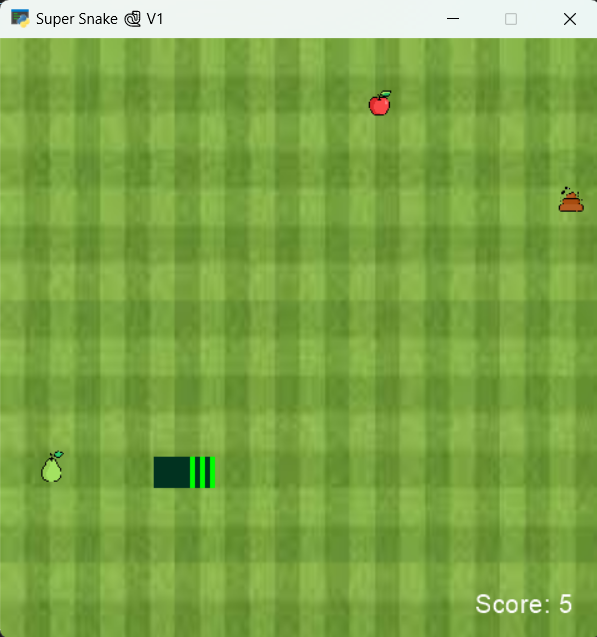

# Game snake 🐍 V1
This is a game made by **Python**

## How to play
Move to the up: Press key UP

Move to the right: Press key RIGHT

Move to the down: Press key DOWN

Move to the left: Press key LEFT

If you hit your body, if you leave the game screen or your score be negative, you will lose

Game Environment:



## Installation
``` 
pip install arcade
```